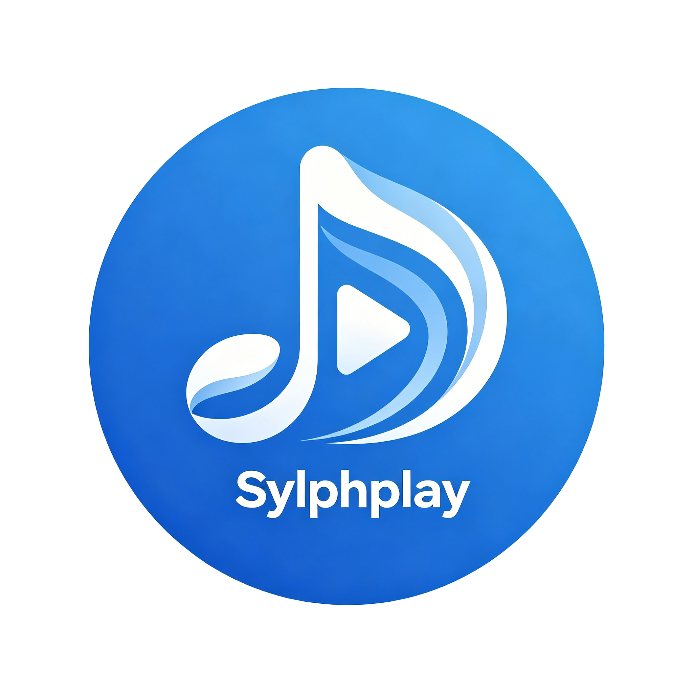
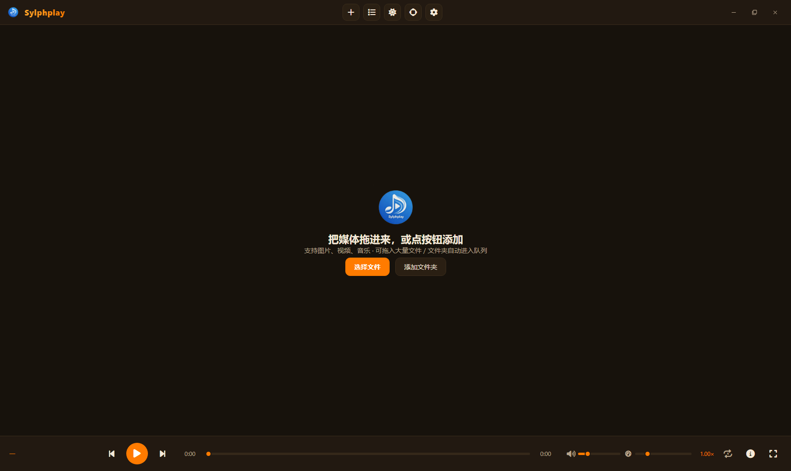

<div align="center">



# Sylphplay

**一款轻量、开源的本地多媒体播放器 —— 支持音频、视频与图片**

桌面版（Electron）· 手机版（Flutter）· 不联网 · 无广告 · 无曲库




</div>

***

## 项目定位

Sylphplay **不是**一个音乐播放器 —— 它同时面向**音频、视频、图片**三类媒体：

- 音频 / 视频：完整的播放控制（倍速、画质调节、全屏、进度条悬停预览）

- 图片：支持鹰眼图（Eagle Eye）缩略预览、视窗跟随拖动

- 歌词：支持 LRC / 卡拉 OK 逐词歌词，桌面歌词悬浮窗

它是一款**强调本地、坚守初心**的个人项目：**没有**在线曲库、音乐市场或任何付费/版权依赖，也不打算与 "云音乐" 类产品竞争。详见 [CONTRIBUTING.md](CONTRIBUTING.md) 中的方向约束。

***

## 项目组成

本仓库同时包含 Sylphplay 的两端实现，两者功能对齐、各自独立构建：

| 端     | 技术                    | 支持平台                      | 代码位置     |
| ----- | --------------------- | ------------------------- | -------- |
| 桌面版   | Electron 33 + 原生前端    | Windows / macOS / Linux   | 仓库根目录    |
| 手机版   | Flutter（Dart）         | Android / iOS             | [mobile/](mobile/) |

> 发布产物示例：`Sylphplay-1.0.0-Windows-x64-Setup.exe`、`Sylphplay-1.0.0-Android.apk`、`Sylphplay-1.0.0-iOS.ipa`。

***

## 桌面版

### 平台支持

| 能力 | Windows | macOS | Linux |
| --- | --- | --- | --- |
| 音视频 / 图片播放、队列、桌面歌词 | ✅ | ✅ | ✅ |
| 常驻托盘、关闭到后台播放 | ✅ | ✅ | ✅ |
| 「以 Sylphplay 打开」转发 | ✅ 注册表关联 | ✅ Finder `open-file` | ✅ 命令行参数 |
| 设为默认打开方式 | ✅ | — | — |
| 强制对齐 DLC（字级歌词） | ✅ | — | — |

> macOS / Linux 上「设为默认打开方式」与「强制对齐 DLC」不可用：这两个功能的实现依赖 Windows 专有的 `assoc-helper.exe` 与对齐引擎，相关入口与 IPC 已在非 Windows 平台自动禁用。

### 功能特性

- 多格式媒体播放：音频 / 视频 / 图片一体体验（内置识别 38 种扩展名）

- 本地优先：支持拖拽文件、文件夹、浏览器标签页 URL 进播放

- 播放队列：可持久化（重启保留）、支持拖拽排序、不切换当前播放

- 桌面歌词：可随窗口拖动、独立置顶小窗，双语 LRC 与逐字填充

- 全屏模式：仅显示媒体内容，鼠标移动至边缘才浮现工具栏，超时自动隐藏

- 图片鹰眼图：缩略图 + 视窗框拖动定位

- 深浅主题切换

- 常驻托盘：关闭窗口后后台继续播放，支持单实例转发「以 Sylphplay 打开」

- 设为默认打开方式：通过内置 .NET helper 一键关联 38 种媒体格式（免管理员权限，**仅 Windows**）

- 实验特性（设置中开启）：倍速滑块、歌词逐字渐变填充、自动寻找缺失歌词（LRCLIB）、强制对齐 DLC（**仅 Windows**）

### 运行环境与依赖

- OS：Windows 10 / 11、macOS 10.15+、主流 Linux 发行版（x64）

- Node.js：**22+**（pnpm 12 要求 Node 22 起）

- 包管理器：**pnpm**（推荐 12+，构建脚本白名单见 [pnpm-workspace.yaml](pnpm-workspace.yaml)）

- .NET SDK：**net10.0**（仅 **Windows** 构建 `assoc-helper` 时需要，用于生成文件关联工具）

#### 技术栈

| 层      | 技术                                             |
| ------ | ---------------------------------------------- |
| 桌面框架   | Electron 33                                    |
| 界面     | 原生 HTML / CSS / JavaScript（无前端框架）              |
| 图标     | Font Awesome Free 6                            |
| 文件外联工具 | C# / .NET（`assoc-helper`，自包含单文件，仅 Windows）       |
| 打包     | electron-builder（Windows NSIS / macOS dmg / Linux deb） |

### 快速开始

```bash
# 1. 安装依赖（务必使用 pnpm）
pnpm install

# 2. 开发模式启动
pnpm start          # 生产模式
pnpm dev            # 开发模式（带 --dev 标记）

# 3. 构建安装包（按目标平台选择，产物输出到 dist/）
pnpm dist:win       # Windows：NSIS 安装包（会先编译 .NET helper）
pnpm dist:mac       # macOS：dmg
pnpm dist:linux     # Linux：deb
```

> `pnpm dist` 等价于 `pnpm dist:win`。

#### 构建平台注意事项

- **macOS 包必须在 macOS 上构建**（生成 `.icns` / `.dmg` 依赖系统的 `iconutil`、`hdiutil`，需安装 Xcode Command Line Tools）。产物默认未签名，首次打开会被 Gatekeeper 拦截，正式分发需 Apple 开发者签名与公证。
- **Linux 包建议在 Linux（或 Docker）中构建**：deb 需要 `dpkg`、`fakeroot` 与 `binutils`（`ar`）。
- 原生依赖（`sharp`、`@resvg/resvg-js`）会按各平台自动安装对应二进制，无需额外处理。
- 仓库默认使用**官方源**（npm 官方仓库 / Electron 官方分发），以保证 CI 构建速度；国内本地开发若嫌慢，可在用户级 `~/.npmrc` 自行配置镜像，不影响仓库。

### 项目结构

```
.
├── main.js                  # 主进程：窗口管理、系统集成、IPC、托盘、文件关联、桌面歌词、DLC
├── preload.js               # 预加载脚本：安全暴露 window.sylph API（含平台标识）
├── package.json             # 依赖 / 打包配置（electron-builder，含 win/mac/linux 目标）
├── pnpm-workspace.yaml      # pnpm 配置：允许 electron 执行安装脚本（allowBuilds）
├── .github/workflows/       # CI：按 tag 自动构建各端产物（仅上传 artifact，不发布 Release）
├── app/
│   ├── index.html           # 主界面（HTML 骨架）
│   ├── styles.css           # 主界面样式
│   ├── renderer.js          # 渲染进程逻辑（媒体/队列/歌词/设置/实验特性）
│   ├── lyrics.html          # 桌面歌词悬浮窗
│   ├── align.html           # 强制对齐窗口（Windows）
│   ├── align.js             # 强制对齐窗口逻辑（Windows）
│   └── sylph.svg            # 矢量品牌资源
├── assets/                  # 图标（icon.ico / icon.png）与 Font Awesome 静态资源
├── assoc-helper/            # C# 文件关联工具源（net10，自包含免依赖，仅 Windows）
├── mobile/                  # 手机版 Flutter 工程（见 mobile/README.md）
└── dist/                    # electron-builder 输出目录（构建生成，勿提交）
```

### 设置默认打开方式（Windows）

1. 打开应用 → 设置 → 「设为默认打开方式」
2. 应用会调用 `assoc-helper`，在**当前用户**级别注册 38 种媒体格式的关联（无需管理员权限）
3. 之后在资源管理器右键媒体文件选择 **以 Sylphplay 打开**，或右键 **加入到 Sylphplay 播放队列**

> 非 Windows 平台不提供该功能；未打包的运行环境（`pnpm dev`）同样不会执行 .NET helper。

### 强制对齐 DLC（Windows）

用于给普通歌词做**字级强制对齐**，生成可逐字高亮的歌词：

1. 设置 → 实验特性 → 开启「强制对齐 DLC」并按提示下载对齐引擎（存放于用户数据目录 `dlc/`）
2. 下载完成后，顶栏出现「强制对齐」按钮，打开内置对齐窗口
3. 选择音频与歌词，运行对齐即可

> 该功能依赖 Windows 版对齐引擎，macOS / Linux 上不显示入口。

### 架构说明

Sylphplay 桌面版采用 Electron 经典三进程模型：

- **主进程（main.js）**：仅处理系统集成 —— 窗口生命周期、单实例锁、托盘、系统打开转发、文件关联 IPC、桌面歌词窗口、DLC 管理、后台节流。

- **渲染进程（app/）**：全部业务 UI 与媒体逻辑，通过 `window.sylph`（[preload.js](preload.js) 暴露）与主进程通信。

- **辅助进程 corp（assoc-helper）**：独立 .NET 单文件可执行，仅在用户主动点击「设为默认打开方式」时被主进程调用（仅 Windows）。

#### 跨平台适配

- 平台判定集中为 `IS_WIN / IS_MAC / IS_LINUX` 常量，DLC、「设为默认打开方式」等 Windows 专有能力在 IPC 层做守卫，非 Windows 直接返回不支持。
- **托盘**：Windows 单击唤回窗口；macOS 使用模板图标（随菜单栏明暗自动反色）、单击弹出菜单、关闭到托盘时隐藏 Dock；Linux 不依赖不可靠的 `click` 事件，统一走托盘菜单。
- **文件打开**：macOS 经 `app.on('open-file')` 接收 Finder 的打开请求（含启动前的事件排队），与 Windows/Linux 的命令行参数路径统一后转发给渲染进程。

音频后端基于 Web Audio / HTML5 media 元素。已知限制：Windows 下独占模式或默认设备切换时的 WASAPI 端点抢占可能造成短暂音频中断，属 Chromium 硬限制，无法在 JS 层修复。

***

## 手机版

手机版位于 [mobile/](mobile/)，使用 Flutter 开发，与桌面版共享同一套产品定位与交互思路（音频 / 视频 / 图片三合一、本地优先、无在线曲库）。详见 [mobile/README.md](mobile/README.md)。

### 功能特性

- 音频 / 视频 / 图片本地播放，支持选择文件与文件夹并扫描本地媒体目录

- 播放队列：可持久化，支持列表 / 网格视图

- 歌词：LRC 解析（含 GBK 编码兜底，兼容酷我等下载源）、逐字高亮、联网自动查找（LRCLIB）

- 音频可视化频谱

- 后台播放：锁屏 / 通知栏 / 耳机线控按键控制背景播放

- 深浅主题、播放倍速与实验特性设置

- 视频缩略图预览、文件信息查看

### 环境与构建

- Flutter SDK：需要 Dart `>=3.4.0`

- Android：构建与运行无需额外工具链（运行时权限已适配 Android 13+ 的 `READ_MEDIA_*`）

- iOS：需在 **macOS + Xcode** 上构建；后台音频已在 `Info.plist` 声明 `UIBackgroundModes: audio`

```bash
cd mobile

flutter pub get            # 安装依赖

flutter run                # 调试运行
flutter build apk --release      # 构建 Android APK
flutter build ipa --release      # 构建 iOS 包（需 macOS + Xcode）
```

### 目录结构

```
mobile/
├── lib/
│   ├── main.dart            # 入口：初始化后台音频与音频会话
│   ├── models/              # 数据模型（媒体项、应用设置）
│   ├── state/               # 播放状态与应用状态
│   ├── logic/               # 歌词、自动查找、可视化、缩略图、媒体探测
│   ├── theme/               # 主题
│   └── ui/                  # 界面（音频 / 视频 / 图片 / 队列 / 设置 / 信息）
├── android/                 # Android 工程
├── ios/                     # iOS 工程
└── assets/                  # 图标等静态资源
```

***

## 贡献

欢迎提交 Issue 与 Pull Request！在动手前请先阅读：

- [CONTRIBUTING.md](CONTRIBUTING.md) —— 贡献规范与产品方向约束

### 对「加曲库」类 PR 的说明

Sylphplay 是一个定位明确的本地播放器（音频 + 视频 + 图片）。**我们不会**添加音乐市场、在线曲库或付费/版权内容功能 —— 这既出于个人项目的版权与付费现实，也为了避免偏离「不只做音乐」的产品初心。此类请求会被友好地关闭，感谢理解。

***

## 开源协议

本项目基于 [MIT](LICENSE) 协议开源。

> 媒体内容版权归各自版权方所有，Sylphplay 仅提供本地播放能力，不包含任何受版权保护的内容或在线资源。